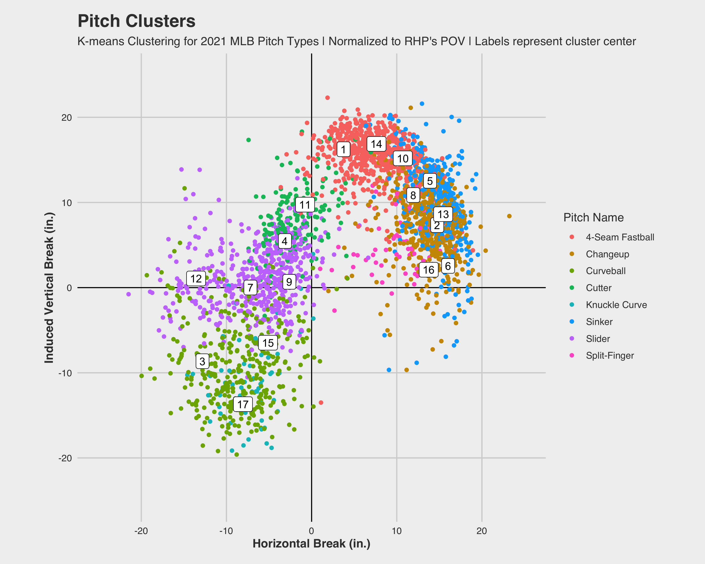

```{r setup, include=FALSE}
options(htmltools.dir.version = FALSE)
knitr::opts_chunk$set(
  eval = FALSE,
  message = FALSE,
  warning = FALSE,
  fig.retina = 4
  )

library(xaringanExtra)
library(xaringanthemer)

```

```{r xaringan-themer, include=FALSE, warning=FALSE, eval = TRUE, echo = FALSE}
use_tachyons()
style_mono_accent(
  base_color = "#005A9C"
)
```

```{r BTS Setup, eval = TRUE, include = FALSE}
library(tidyverse)
library(cluster)
library(umap)
library(gt)
library(gtExtras)
# Columns needed
needed_columns <- c("pitch_name", 
                    "release_speed",
                    "pfx_x_pv_adj", "pfx_z",
                    "release_spin_rate")

# Load game data
data <- tRead::load_seasons(2021) |> 
  filter(game_type == "R") |> 
  group_by(pitcher) |> 
  filter(n() >= 150, !pitch_name %in% c("Eephus", "Fastball", "Screwball")) |> 
  ungroup() |> 
  drop_na(all_of(needed_columns)) |> 
  tRead::add_est_spin_efficiency() |> 
  drop_na(est_spin_efficiency)
  
  # Find "average" FB
  p_avgs <- data |>
  group_by(game_year, pitcher) |>
  top_frac(0.10, release_speed) |> # Top 10% of hardest pitches thrown are used as the av. FB
  summarize(avg_velo = mean(release_speed, na.rm=TRUE))

# Combine data with "averages"
raw_data <- data |> 
  left_join(p_avgs,  by = c("game_year", "pitcher")) |> 
  mutate(velo_ratio = if_else(release_speed/avg_velo > 1, 1, release_speed/avg_velo))

# Getting pitch averages differences
cleaned_mlb <- raw_data |>
  group_by(pitcher, player_name, pitch_name, pitch_type) |> 
  summarize(avg_velo_ratio = mean(velo_ratio, na.rm = TRUE)*100,
            avg_horz = mean(pfx_x_pv_adj, na.rm = TRUE),
            avg_vert = mean(pfx_z, na.rm = TRUE),
            avg_eff = mean(est_spin_efficiency, na.rm = TRUE)) |> 
  ungroup()
```


class: inverse center middle
# Setup

---
class: center
```{r Setup1, eval = FALSE}
library(tidyverse)
library(cluster)
library(umap)
library(gt)
library(gtExtras)
# library(tRead) - personal package made for common tasks
set.seed(1)

needed_columns <- c("pitch_name", "release_speed",
                    "pfx_x_pv_adj", "pfx_z",
                    "release_spin_rate")

# Load game data and remove those who didn't throw at least 150 pitches
data <- tRead::load_seasons(2021) |>
  filter(game_type == "R") |>
  group_by(pitcher) |>
  filter(n() >= 150, 
         !pitch_name %in% c("Eephus", "Fastball", "Screwball")) |>
  ungroup() |>
  drop_na(all_of(needed_columns)) |>
  tRead::add_est_spin_efficiency() |>
  drop_na(est_spin_efficiency)
```

---
class: center
```{r insert-logo, eval = TRUE, echo = FALSE}
use_logo("https://a.espncdn.com/i/teamlogos/mlb/500/lad.png",
          width = "40px",
          height = "40px",
          position = css_position(bottom = "0.75em", left = "1em"),)
```

```{r Setup2, eval = FALSE}
# Find "average" FB
p_avgs <- data |>
  group_by(game_year, pitcher) |>
  # Top 10% of hardest pitches thrown are used as the av. FB
  top_frac(0.10, release_speed) |> 
  summarize(avg_velo = mean(release_speed, na.rm=TRUE))

# Combine data with "averages"
raw_data <- data |>
  left_join(p_avgs,  by = c("game_year", "pitcher")) |>
  mutate(velo_ratio = if_else(release_speed/avg_velo > 1, 
                              1, release_speed/avg_velo))

# Getting pitch averages differences
cleaned_mlb <- raw_data |>
  group_by(pitcher, player_name, pitch_name, pitch_type) |>
  summarize(avg_velo_ratio = mean(velo_ratio, na.rm = TRUE)*100,
            avg_horz = mean(pfx_x_pv_adj, na.rm = TRUE),
            avg_vert = mean(pfx_z, na.rm = TRUE),
            avg_eff = mean(est_spin_efficiency, na.rm = TRUE)) |>
  ungroup()
```

---
class: inverse center middle
# Clustering

---
class: center
# Make the Model
```{r, eval = FALSE}
cluster_data <- cleaned_mlb |> 
  select("avg_velo_ratio", "avg_vert", "avg_horz", "avg_eff")
  
# Create clusters
cleaned_clusters <- pam(cluster_data, k = 17, metric = "euclidean")

# Save Medoids
write_csv(cleaned_clusters$medoids |> as_tibble(), "./Medoids.csv")
```

---
class: center
# Cluster Function
```{r, eval = FALSE}
# Loading saved medoids
saved_clusters <- read_csv("./Medoids.csv")

# Functions to return pitch cluster
eucDist <- function(x, y) sqrt(sum( (x-y)^2 ))

classifyNewSample <- function(newData, centroids = saved_clusters) {
  dists = apply(centroids, 1, function(y) eucDist(y,newData))
  order(dists)[1]
}

# Add clusters based on saved Medoids
mlb_clusters <- cleaned_mlb |> 
  mutate(cluster = apply(cluster_data, 1, classifyNewSample),
         cluster = as.factor(cluster))
```

---
class: inverse center middle
# Analysis

---
class: center
# Table
```{r, eval = FALSE}
#Analyze old pitch_names with clusters
table(mlb_clusters$cluster, mlb_clusters$pitch_type)
```

```{r, echo = FALSE, eval = TRUE}
# Manually making table here instead of having the models retrain after every "knit"
# Loading saved medoids
saved_clusters <- read_csv("./Medoids.csv")

# Functions to return pitch cluster
eucDist <- function(x, y) sqrt(sum( (x-y)^2 ))

classifyNewSample <- function(newData, centroids = saved_clusters) {
  dists = apply(centroids, 1, function(y) eucDist(y,newData))
  order(dists)[1]
}

# Add clusters based on saved Medoids
mlb_clusters <- cleaned_mlb |> 
  mutate(cluster = apply(cleaned_mlb |> 
                           select("avg_velo_ratio", "avg_vert", "avg_horz", "avg_eff"), 
                         1, classifyNewSample),
         cluster = as.factor(cluster))

table(mlb_clusters$cluster, mlb_clusters$pitch_type)


```

---
class: center
# Clustered Plots

.pull-left[
```{r, eval = TRUE, echo = FALSE}
# Code to make plots included in full script

```
]

.pull-right[
```{r, eval = TRUE, echo = FALSE}
# Code to make plots included in full script

```
]

---
class: center
# UMAP
```{r, eval = FALSE}

custom_config <- umap.defaults
custom_config$n_neighbors = 200
custom_config$min_dist = .4

umap_data <- mlb_clusters |> 
  select("avg_velo_ratio", "avg_vert", "avg_horz", "avg_eff")

umap_testing <- umap(umap_data, config = custom_config)

umap_plot_data <- mlb_clusters |>
  mutate(x = umap_testing$layout[,1],
         y = umap_testing$layout[,2])
```

---
class: center
# UMAP Plot

```{r, eval = TRUE, echo = FALSE, out.width = "80%"}
# Code to make plots included in full script

```

---
class: center
# Testing
```{r, eval = FALSE}
# Map of pitchers and the clusters each of their pitches belong to
pitcher_pitch_map <- mlb_clusters |> 
  select(pitcher, player_name, pitch_name, cluster)

# Combine the map with raw data and find averages for each pitch type
combined_data <- raw_data |> 
  left_join(pitcher_pitch_map) |> 
  mutate(adj_spin_axis = if_else(p_throws == "R", 
                                 spin_axis, 360-spin_axis)) |> 
  group_by(pitcher, pitch_name, cluster) |> 
  summarize(velo_ratio = mean(velo_ratio, na.rm = TRUE),
            pfx_z = mean(pfx_z, na.rm = TRUE),
            pfx_x_pv_adj = mean(pfx_x_pv_adj, na.rm = TRUE),
            est_spin_efficiency = 
              mean(est_spin_efficiency, na.rm = TRUE),
            release_spin_rate = mean(release_spin_rate, na.rm = TRUE),
            adj_spin_axis = mean(adj_spin_axis, na.rm = TRUE)) |> 
  ungroup()
```

---
class: center
# Transform Data
```{r, eval = FALSE}
# Turn the combined data into a long df for plotting with a facet_wrap
filtered_data <- combined_data |> 
  select(cluster, velo_ratio, pfx_z, pfx_x_pv_adj, 
         est_spin_efficiency, release_spin_rate, adj_spin_axis)

long_data <- filtered_data |> 
  pivot_longer(!cluster, names_to = "metric", values_to = "value")

```

---
class: center
# Metric Ranges and Distributions
```{r, eval = TRUE, echo = FALSE}
# Code to make plot included in full script

```

---
class: center
# Metric Averages
```{r, eval = TRUE, echo = FALSE}
# Code to make chart included in full script

```

---
class: center
# Pitch Results Averages
```{r, eval = TRUE, echo = FALSE}
# Code to make chart included in full script

```

---
class: center
# "New" Pitch Groups
```{r, eval = TRUE, echo = FALSE, out.width = "80%"}
# Code to make chart included in full script
knitr::include_graphics("./Images/Movement Clusters by New Pitch Group.png")
```